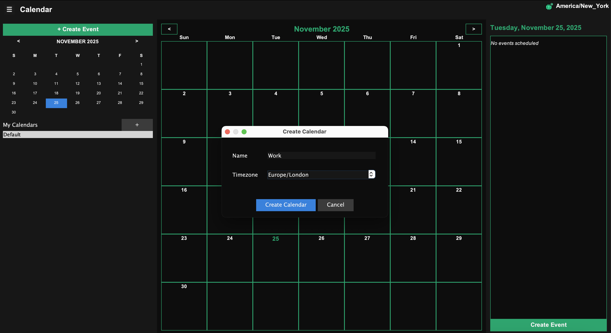
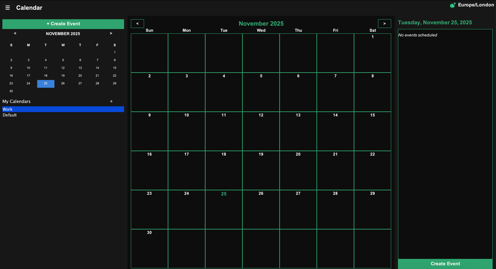
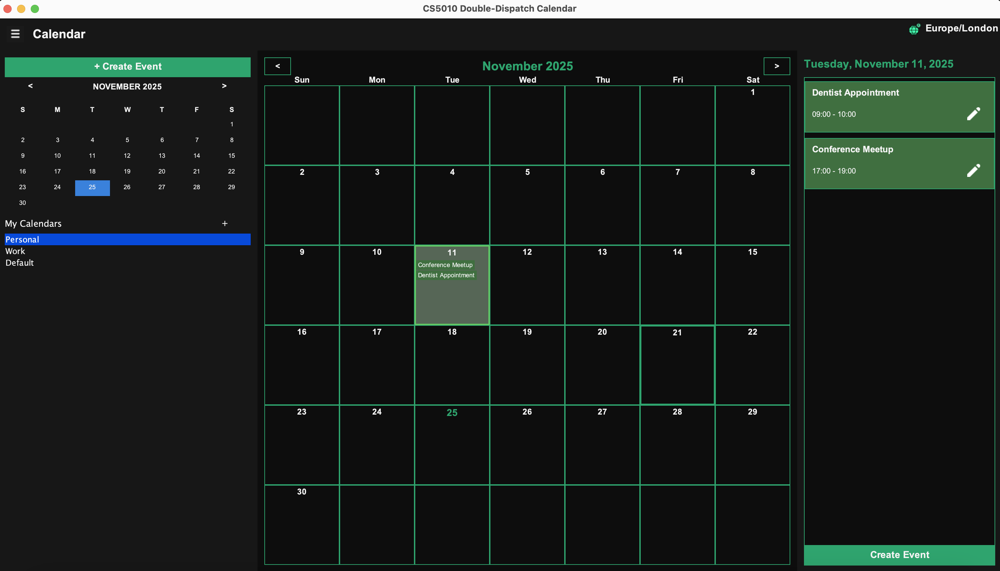
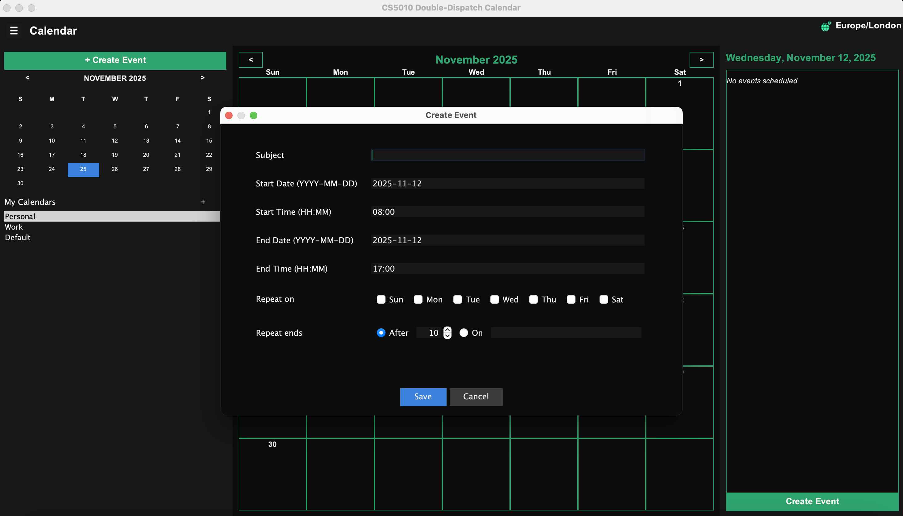
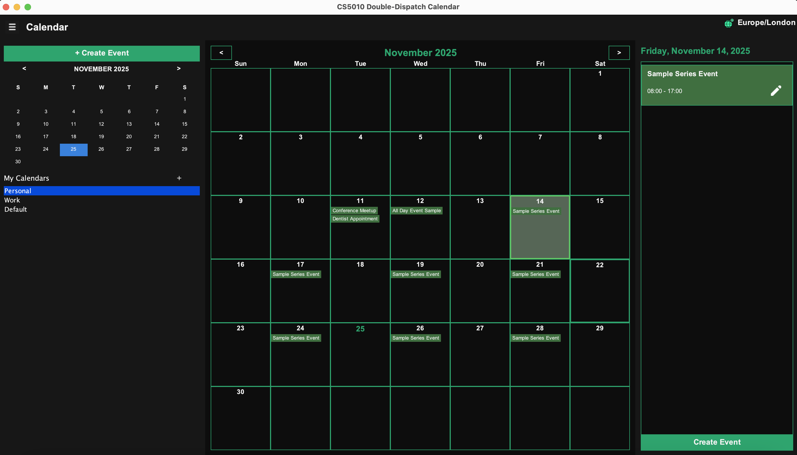
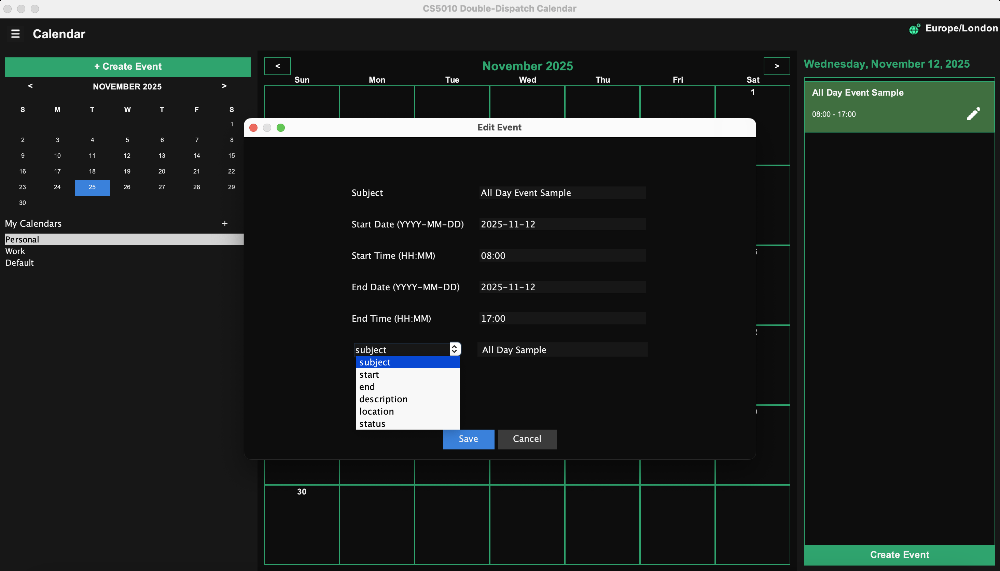
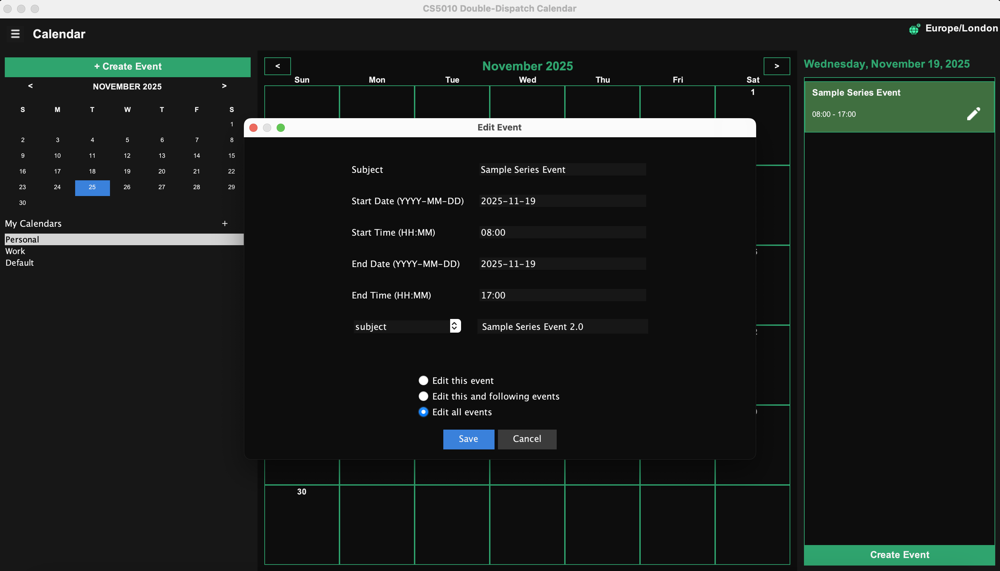
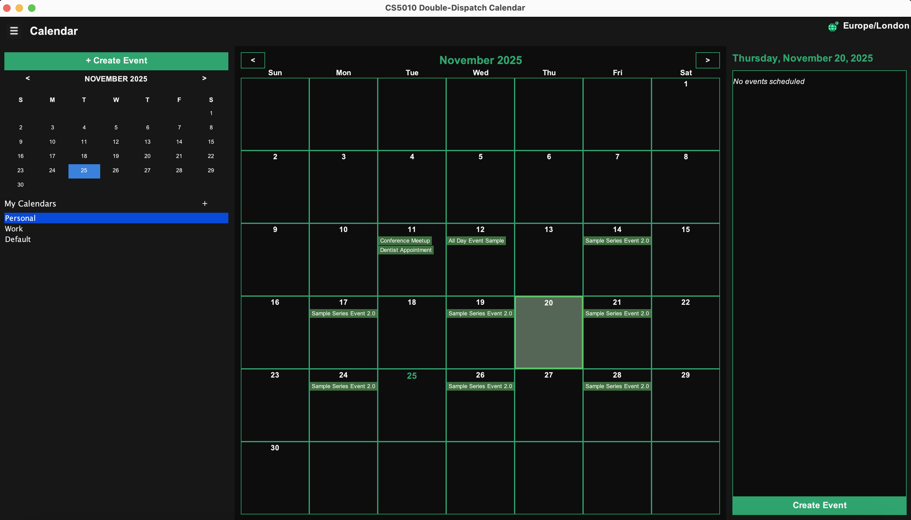
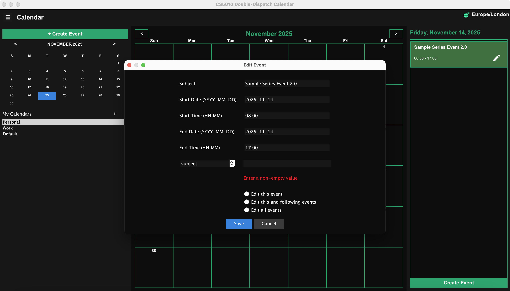
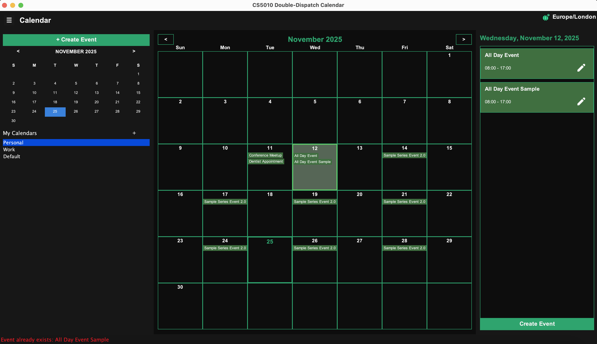

# User Guide

## Overview
This is a command-line calendar application that allows you to create multiple calendars with different timezones, manage events and event series, and copy events across calendars. The application supports both interactive and headless modes.

## Building the Application

### Creating the JAR File
From the project root directory, run:
```bash
./gradlew jar
```

This creates a JAR file in `build/libs/` directory.

## Running the Application

The application can be run in two modes: **interactive** and **headless**.

### Interactive Mode
In interactive mode, you can type commands one at a time and see immediate results.

**Command:**
```bash
java -jar build/libs/JARNAME.jar --mode interactive
```

Once started, you can enter commands at the prompt. Type `exit` to quit.

### Headless Mode
In headless mode, the application reads commands from a text file and executes them sequentially.

**Command:**
```bash
java -jar build/libs/JARNAME.jar --mode headless <path-to-commands-file>
```

**Note:**
- The commands file must end with an `exit` command
- If the file ends without an `exit` command, an error message will be displayed


## Command Reference

### Date and Time Format
- **Date:** `YYYY-MM-DD` (e.g., `2025-11-02`)
- **Time:** `HH:mm` (24-hour format, e.g., `15:00`)
- **DateTime:** `YYYY-MM-DDTHH:mm` (e.g., `2025-11-02T15:00`)
- **Weekdays:** Use characters: `M` (Monday), `T` (Tuesday), `W` (Wednesday), `R` (Thursday), `F` (Friday), `S` (Saturday), `U` (Sunday)

### Managing Multiple Calendars

#### Create a New Calendar
```
create calendar --name <calendarName> --timezone <timezone>
```
**Example:**
```
create calendar --name "Work Calendar" --timezone America/New_York
create calendar --name "Personal Calendar" --timezone Asia/Kolkata
```

**Supported Timezones:**
- `America/New_York` - Eastern Time
- `America/Los_Angeles` - Pacific Time
- `America/Chicago` - Central Time
- `Europe/Paris` - Central European Time
- `Europe/London` - Greenwich Mean Time
- `Asia/Kolkata` - Indian Standard Time
- `Asia/Tokyo` - Japan Standard Time
- `Australia/Sydney` - Australian Eastern Time
- `Africa/Cairo` - Egypt Standard Time
- And all other IANA Time Zone Database formats

**Note:** Calendar names must be unique. An error will be displayed if you attempt to create a calendar with a duplicate name.

#### Edit Calendar Properties
```
edit calendar --name <calendarName> --property <propertyName> <newValue>
```

**Example:**
```
edit calendar --name "Work Calendar" --property name "Business Calendar"
edit calendar --name "Personal Calendar" --property timezone Europe/Paris
```

**Editable Properties:**
- `name` - Change the calendar name (must be unique)
- `timezone` - Change the calendar timezone (must be valid IANA timezone)

#### Switch Active Calendar
```
use calendar --name <calendarName>
```
**Example:**
```
use calendar --name "Work Calendar"
```

**Important:** All subsequent event creation, editing, querying, and exporting commands operate on the active calendar. You must switch calendars before working with events in a different calendar.

### Creating Events

#### Single Event with Time
```
create event <eventSubject> from <dateTimeString> to <dateTimeString>
```
**Example:**
```
create event DoctorAppointment from 2025-11-02T15:00 to 2025-11-02T16:00
```

#### All-Day Event
```
create event <eventSubject> on <dateString>
```
**Example:**
```
create event TeamsMeeting on 2025-11-03
```
*Default time: 8:00 AM to 5:00 PM*

#### Event Series with Count
```
create event <eventSubject> from <dateTimeString> to <dateTimeString> repeats <weekdays> for <N> times
```
**Example:**
```
create event WeeklyMeeting from 2025-11-03T15:00 to 2025-11-03T16:00 repeats MTF for 5 times
```

#### Event Series Until Date
```
create event <eventSubject> from <dateTimeString> to <dateTimeString> repeats <weekdays> until <dateString>
```
**Example:**
```
create event DailyStandup from 2025-11-02T09:00 to 2025-11-02T09:30 repeats MTWRF until 2025-12-31
```

#### All-Day Event Series
```
create event <eventSubject> on <dateString> repeats <weekdays> for <N> times
create event <eventSubject> on <dateString> repeats <weekdays> until <dateString>
```
**Example:**
```
create event Holiday on 2025-12-25 repeats S for 3 times
```

**Note:** Event subjects with multiple words must be enclosed in double quotes:
```
create event "Team Building Activity" from 2025-11-15T10:00 to 2025-11-15T17:00
```

### Editing Events

#### Edit Single Event
Edits only one instance of an event (even if it's part of a series).
```
edit event <property> <eventSubject> from <dateTimeString> to <dateTimeString> with <newValue>
```
**Example:**
```
edit event subject DoctorAppointment from 2025-11-02T15:00 to 2025-11-02T16:00 with Doctor_Appointment
```

#### Edit This and Following Events
Edits the specified event and all subsequent events in the series. If not part of a series, behaves like "edit event".
```
edit events <property> <eventSubject> from <dateTimeString> with <newValue>
```
**Example:**
```
edit events subject WeeklyMeeting from 2025-11-15T15:00 with Weekly_Team_Meeting
```

#### Edit Entire Series
Edits all events in the series. If not part of a series, behaves like "edit event".
```
edit series <property> <eventSubject> from <dateTimeString> with <newValue>
```
**Example:**
```
edit series location DailyStandup from 2025-11-02T09:00 with ONLINE
```

#### Editable Properties
- `subject` - Event title (string)
- `start` - Start date/time (dateTimeString format)
- `end` - End date/time (dateTimeString format)
- `description` - Event description (string, use quotes for multi-word)
- `location` - Event location (`ONLINE` or `PHYSICAL`)
- `status` - Event visibility (`PUBLIC` or `PRIVATE`)

**Examples:**
```
edit event start Meeting from 2025-11-03T15:00 to 2025-11-03T16:00 with 2025-11-03T15:30
edit event location Meeting from 2025-11-03T15:30 to 2025-11-03T16:00 with ONLINE
edit event status Meeting from 2025-11-03T15:30 to 2025-11-03T16:00 with PRIVATE
edit event description Meeting from 2025-11-03T15:30 to 2025-11-03T16:00 with "Quarterly review meeting"
```

**Important Notes:**
- Changing the start time of events in a series may split the series
- Edits cannot create duplicate events (same subject, start, and end)

### Querying Events

#### Print Events on a Specific Date
```
print events on <dateString>
```
**Example:**
```
print events on 2025-11-04
```

#### Print Events in a Date Range
```
print events from <dateTimeString> to <dateTimeString>
```
**Example:**
```
print events from 2025-11-01T01:00 to 2025-11-30T23:00
```

#### Check Busy Status
```
show status on <dateTimeString>
```
**Example:**
```
show status on 2025-11-02T15:00
```
*Output: Either "busy" or "available"*

### Copying Events Between Calendars

#### Copy Single Event
```
copy event <eventName> on <dateTime> --target <targetCalendarName> to <dateTime>
```
**Example:**
```
copy event "Team Meeting" on 2025-11-04T14:00 --target "Personal Calendar" to 2025-11-05T15:00
```

**Notes:**
- Copies a specific event from the current calendar to the target calendar
- The "to" date/time is interpreted in the target calendar's timezone
- Series events are copied as standalone events (not as a series)
- Duration is preserved
- Event properties (description, location, status) are maintained
- If an event spans multiple days, and copy event executed on one of the in progress days, then the event get copied 

#### Copy All Events on a Date
```
copy events on <dateString> --target <targetCalendarName> to <dateString>
```
**Example:**
```
copy events on 2025-11-04 --target "Personal Calendar" to 2025-11-15
```

**Notes:**
- Copies all events scheduled on the specified date from the current calendar
- Times are converted to the target calendar's timezone
- **Example:** An event at 2:00 PM EST (source) becomes 11:00 AM PST (target) due to timezone difference
- Series events are copied as standalone events
- Events maintain their duration and properties
- All copied events lose their series relationship (become standalone)
- If an event spans multiple days, and copy event executed on one of the in progress days, then the event get copied

#### Copy Events Within a Date Range
```
copy events between <startDate> and <endDate> --target <targetCalendarName> to <startDate>
```
**Example:**
```
copy events between 2025-11-01 and 2025-11-30 --target "Personal Calendar" to 2025-12-01
```

**Notes:**
- Copies all events that overlap with the specified date range from the current calendar
- Both start and end dates are **inclusive**
- All events are shifted by the offset (targetStartDate - sourceStartDate)
- **Example:** Event on Nov 5 with offset of +30 days → copied to Dec 5
- If a series partly overlaps with the date range, only overlapping events are copied
- **Series status is retained** - copied events remain part of their series in the target calendar
- All copied events retain their properties (subject, description, location, status)
- Duration and timing are maintained

### Exporting Calendar

#### Export to CSV
```
export cal <filename.csv>
```
**Example:**
```
export cal my_calendar.csv
```

The exported CSV file:
- Is compatible with Google Calendar
- Contains all events and series in the active calendar
- Includes the absolute file path in the output
- Can be imported directly into Google Calendar

### Miscellaneous

#### Exit Application
```
exit
```
Stops the application gracefully.

## Complete Example Session

Here's a sample interactive session with multiple calendars:

```
$ java -jar build/libs/calendar.jar --mode interactive

> create calendar --name "Work Calendar" --timezone America/New_York
Calendar created successfully

> create calendar --name "Personal Calendar" --timezone Asia/Kolkata
Calendar created successfully

> use calendar --name "Work Calendar"
Switched to Work Calendar

> create event "Morning Standup" from 2025-11-04T09:00 to 2025-11-04T09:30 repeats MTWRF for 10 times
Event series created successfully

> create event Lunch on 2025-11-04
Event created successfully

> print events on 2025-11-04
- Morning Standup starting on 2025-11-04 at 09:00, ending on 2025-11-04 at 09:30
- Lunch starting on 2025-11-04 at 08:00, ending on 2025-11-04 at 17:00

> show status on 2025-11-04T09:15
busy

> copy events on 2025-11-04 --target "Personal Calendar" to 2025-11-10
Copied events on 2025-11-04 to Personal Calendar on 2025-11-10

> use calendar --name "Personal Calendar"
Switched to Personal Calendar

> print events on 2025-11-10
- Morning Standup starting on 2025-11-10 at 20:30, ending on 2025-11-10 at 21:00
- Lunch starting on 2025-11-10 at 13:00, ending on 2025-11-11 at 02:00

> edit calendar --name "Personal Calendar" --property timezone Europe/Paris
Calendar property edited successfully

> export cal work_events.csv
Calendar exported successfully to: /absolute/path/to/work_events.csv

> exit
```

## Sample Command Files
res/commands.txt - contains sample commands covering various supported features.

## Project Structure

```
project-root/
├── src/
│   └── main/
│       └── java/
│           └── CalendarRunner.java  (entry point)
├── res/
│   ├── commands.txt                 (Sample valid commands)
│   ├── invalid.txt                  (Sample with invalid command)
│   └── screenshot.png               (Google Calendar screenshot)
├── build/
│   └── libs/
│       └── calendar.jar             (Generated JAR file)
└── USEME.md                         (This file)
```

---

**Note:** The application uses IANA Time Zone Database formats for all timezone operations. When copying events between calendars with different timezones, times are automatically converted to maintain the correct instant in time.

## Running in GUI Mode

The application can also be run with a graphical user interface for more interactive use.

### Starting GUI Mode

**Command:**
```bash
java -jar build/libs/JARNAME.jar
```

**Or simply double-click the JAR file.**

The GUI will open automatically with a default calendar in your system's timezone.

---

## Using the GUI

### Overview
The GUI provides a month view of your calendar where you can visually see and interact with events. Few key components of the UI include:
- **Calendar List Panel** (left side) - Shows all your calendars
- **Mini Date Picker** (left side) - Quick date navigation
- **Month View** (center) - Main calendar grid with a month view of the calendar
- **Navigation Controls** (top) - Month/year navigation and action buttons

### Calendar Management

#### Creating a New Calendar
- Click the **+** button in the left panel beside **My Calendars**
- Enter the calendar name in the dialog
- Select a timezone from the dropdown menu
- Click **Create Calendar** to confirm
- The new calendar will appear in the calendar list on the left panel

*Calendar creation dialog with name field and timezone dropdown*


#### Switching Between Calendars
- In the **Calendar List** panel on the left side, click on any calendar name
- A notification type message will appear on the bottom informing the user which calendar is in use
- The month view will update to show events from the selected calendar
- All subsequent operations will apply to the currently selected calendar

*Calendar list panel showing multiple calendars with **Work** highlighted as active*


### Navigating the Calendar

#### Viewing Different Months
- Use the **< Previous** and **Next >** buttons at the top to navigate months
- Or click on a date in the **Mini Date Picker** on the left to jump to that month
- The current month and year are displayed prominently at the top center

### Querying and Viewing Events

#### Viewing Events on a Specific Day
- Click on any date cell in the month view
- All events scheduled for that day will be displayed in a popup or side panel
- Events are shown with their time, subject, and other details
- Events are displayed in the calendar's timezone

*Month view with a selected date showing its events in a right panel*


### Creating Events

#### Creating a Single Event
- Click on a date in the month view where you want to create the event
- Click the **"Create Event"** button at the bottom of the right panel
- In the Create Event dialog:
    - Enter the **Subject**
    - Enter **Start Date (YYYY-MM-DD)** (will be pre-populated with the current date)
    - Enter the **Start Time (HH:MM)** (will be pre-populated to 08:00 - start time of an **All Day Event**)
    - Enter the **End Date (YYYY-MM-DD)** (will be pre-populated with the current date)
    - Enter the **End Time (HH:MM)** (will be pre-populated to 17:00 - end time of an **All Day Event**)
- Click **Save** to create the event

**Note:** Clicking on the **Create Event** button above the Mini Date Picker, will open the same Create Event Dialog without the pre-populated date and times (for generic create event purposes).

*Create Event dialog with all identifying fields (subject and start/end datetime) (date and times pre-populated for specific date **Create Event**)*


#### Creating a Recurring Event Series
- Click on a date in the month view
- Click **Create Event** on the right panel
- In the dialog:
    - Enter the **Subject**
    - Enter **Start Date (YYYY-MM-DD)** (will be pre-populated with the current date)
    - Enter the **Start Time (HH:MM)** (will be pre-populated to 08:00 - start time of an **All Day Event**)
    - Enter the **End Date (YYYY-MM-DD)** (will be pre-populated with the current date)
    - Enter the **End Time (HH:MM)** (will be pre-populated to 17:00 - end time of an **All Day Event**)
    - Select **weekdays** for recurrence (M, T, W, R, F, S, U checkboxes)
    - Choose recurrence end type radio (After/On):
        - **After** represents *Number of occurrences*: Increment counter to required count (e.g: 10)
        - **On** represents *Until date*: Enter the date in YYYY-MM-DD format
- Click **Save**

*Create Event dialog with recurring event options showing weekday checkboxes and recurrence end options (count or until date)*


*Series Created (Sample Series Event with M, W, F recurrence having 10 occurrences) as result of above **Save***


### Editing Events

#### Editing a Single Event Instance
- Click on a date with events
- In the events list on the right panel, select the event you want to edit by clicking on the *pencil* icon
- In the **Edit Event** dialog:
  - Select from the dropdown the field/property you want to edit
  - Provide the new value for the field/property in the text box beside
  - Click **Save**

*Edit Event dialog with dropdown to select the field/property to edit and the text box to provide new value*


#### Editing This and Following Events
- Select an event from a recurring series
- Click on the *pencil* icon 
- In the **Edit Event** dialog:
  - Select from the dropdown the field/property you want to edit
  - Provide the new value for the field/property in the text box beside
  - Choose **"Edit this and following events"** from the radio in the **Edit Event** dialog
  - Click **Save**
- All events in the series from this date forward will be updated

#### Editing an Entire Series
- Select an event from a recurring series
- Click on the *pencil* icon
- In the **Edit Event** dialog:
    - Select from the dropdown the field/property you want to edit
    - Provide the new value for the field/property in the text box beside
    - Choose **"Edit all events"** from the radio in the **Edit Event** dialog
    - Click **Save**
- All events in the series will be updated

*Edit a series using the **Edit all events** radio in the **Edit Event** dialog of a series event*


*Series edited as a result of above **Save** (as you can see the subject has changed for all events in series)*


### Additional Features

#### Timezone Display
- The current calendar's timezone is displayed on the top right
- All event times are shown in the calendar's timezone
- When viewing events, the timezone is clearly indicated

### Default Calendar
When you first open the GUI:
- A default calendar is automatically created using your system's current timezone
- You can start creating events immediately without setting up a calendar
- You can create additional calendars or edit the default calendar's properties at any time

---

## Error Handling in GUI

The GUI handles errors gracefully:
- **Invalid input**: Message appears on red at the bottom explaining the problem
- **Duplicate events**: Message appears on red at the bottom informing that the event already exists
- **Missing required fields**: Fields are marked and error message displayed

*Invalid input message:*


*Event already exists message:*


All error messages are user-friendly and guide you on how to fix the issue without exposing technical details.

---

## Complete Example: GUI Workflow

Here's a typical workflow using the GUI:

1. **Start the application** - Double-click the JAR file
2. **Create a work calendar** - Click "Create Calendar", enter "Work", select "America/New_York"
3. **Create recurring meeting** - Click on Monday, Jan 15, 2024, create "Weekly Standup" from 9:00-9:30, recurring on M/W/F for 10 times
4. **View events** - Navigate through months to see all recurring events
5. **Edit one instance** - Select the Feb 5 standup, edit to 9:15-9:45, choose "Edit this event"
6. **Create personal calendar** - Create another calendar called "Personal" with timezone "Asia/Kolkata"
7. **Switch calendars** - Click "Personal" in the calendar list to switch
8. **Create event** - Create another event in "Personal" calendar

---

## Command-Line Arguments Summary

The application supports three execution modes:

| Mode | Command | Description |
|------|---------|-------------|
| **GUI Mode** | `java -jar JARNAME.jar` | Opens graphical interface (default) |
| **Interactive Mode** | `java -jar JARNAME.jar --mode interactive` | Text-based command prompt |
| **Headless Mode** | `java -jar JARNAME.jar --mode headless <script-file>` | Executes commands from file |

**Invalid arguments:** Any other command-line arguments will display an error message and exit gracefully.

---

## Contributors

1. Sesmi Athiyarath - sesmi123
2. Alex Joseph - alex710joseph
